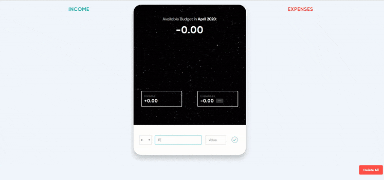

# Budget Management System and Analyzer

#### A budget management web application to keep track of one's incoming and outgoing expenses per month.This has been created using Vanilla JavaScript, HTML, CSS, JSON, PHP, MySQL, Bootstrap 4, SQL, DBC, chart.js and some other JavaScript libraries and frameworks.

## Demo

	

 
- I have used local storage to make data persist.
- You can add, remove, update income, and expense items.
- This will also show us the percentage of each expense item w.r.t total 
income.
- You can delete all items at once with delete all button
- Bar Chart will show the budget percentage w.r.t (income+expense)
- It uses a ring chart to display and indicate the amount of budget left for the month after analyzing and calculating the balance budget
 from the income earned and the expenditure made.
It displays the proportion of the monthly expenses with respect to the total budget/income by calculating the balance and displays it visually in the form of a table as well as a Ring Chart. It is very useful for an individual to maintain his monthly or daily record of budget so that he will be able to manage his expenses accordingly. Data can be easily updated or deleted via buttons that dynamically make it an interactive web application. It can also be used for groups or an organization to analyze their business over the month and drives good decisions.

